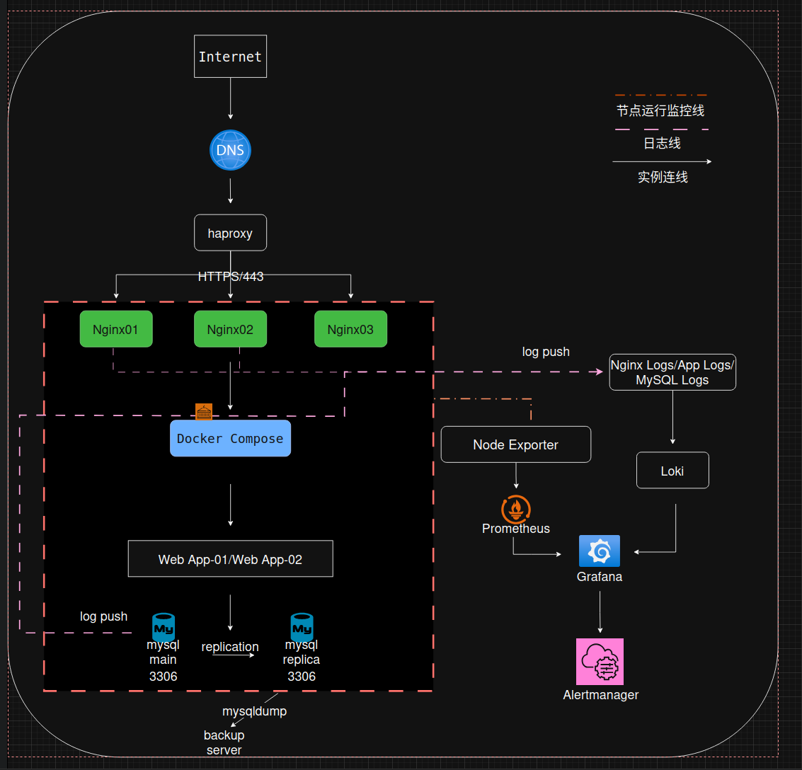

# Cloud Support Portfolio

个人云运维与技术支持实践项目

## About

本项目用于展示个人在 Linux 运维、故障排查、监控告警、自动化运维及技术支持方向的实践能力。

项目内容基于真实运维场景抽象整理，包含：

* 系统架构设计
* 故障处理案例（Incident Response）
* 标准化运维手册（Runbooks）
* 监控平台建设
* 自动化运维脚本

适用于：

* Cloud Support Engineer
* Linux System Engineer
* Technical Support Engineer
* Site Reliability Engineer（Junior）

---

## Technology Stack

### Operating System

* Linux (Ubuntu / CentOS)

### Web & Middleware

* Nginx
* MySQL
* Docker

### Monitoring

* Prometheus
* Grafana

### Automation

* Shell
* Git

---

## Architecture

Web Platform Architecture

### Components

* Nginx Reverse Proxy
* Web Application
* MySQL Database
* Prometheus Monitoring
* Grafana Dashboard

### Objectives

* High Availability
* Monitoring Visibility
* Incident Troubleshooting
* Operational Standardization

---

## Incident Response Cases

### Incident 003 - Nginx 502 Bad Gateway

Scenario

* User access failed
* Nginx returned 502

Skills Demonstrated

* Log Analysis
* Service Verification
* Port Troubleshooting
* Root Cause Analysis

File:

[incidents/003-nginx-502.md](incidents/003-nginx-502.md)

---

### Planned - MySQL Service Down

Scenario

* Application unable to connect database
* MySQL startup failure

Skills Demonstrated

* MySQL Troubleshooting
* Disk Usage Analysis
* Service Recovery

File:

Status: Planned

---

### Incident 002 - Linux Disk Full

Scenario

* Disk utilization exceeded 95%

Skills Demonstrated

* Capacity Analysis
* Log Cleanup
* Linux Administration

File:

[incidents/002-disk-full.md](incidents/002-disk-full.md)

---

## Runbooks

Standard Operating Procedures (SOP)

### Nginx Restart Procedure

[runbooks/nginx-restart.md](runbooks/nginx-restart.md)

### MySQL Backup Procedure

[runbooks/mysql-backup.md](runbooks/mysql-backup.md)

### Docker Troubleshooting Guide

Status: Planned

---

## Monitoring

### Infrastructure Monitoring

Prometheus + Grafana

Monitored Metrics

* CPU Usage
* Memory Usage
* Disk Utilization
* Network Traffic

### Nginx Monitoring

* Requests Per Second
* Active Connections
* HTTP Status Codes
* Response Time

### MySQL Monitoring

* QPS
* Connections
* Slow Queries
* InnoDB Metrics

Files

Planned: monitoring/prometheus-overview.md

Planned: monitoring/grafana-dashboard.md

---

## Automation

### Health Check Script

Functions

* CPU Check
* Memory Check
* Disk Check
* Service Check

File

[automation/healthcheck.sh](automation/healthcheck.sh)

---

### Backup Script

Functions

* MySQL Backup
* Log Archive
* Scheduled Tasks

File

[automation/backup.sh](automation/backup.sh)

---

## Skills Demonstrated

### Linux Administration

* System Management
* Service Operations
* Performance Analysis

### Incident Management

* Troubleshooting
* Root Cause Analysis
* Recovery Procedures

### Monitoring & Observability

* Prometheus
* Grafana
* Alerting

### Automation

* Shell Scripting
* Operational Efficiency

---

## Certifications

Certified Kubernetes Administrator (CKA)

---

## Author

Luo Junjie

Cloud Support Engineer

GitHub Portfolio Project
